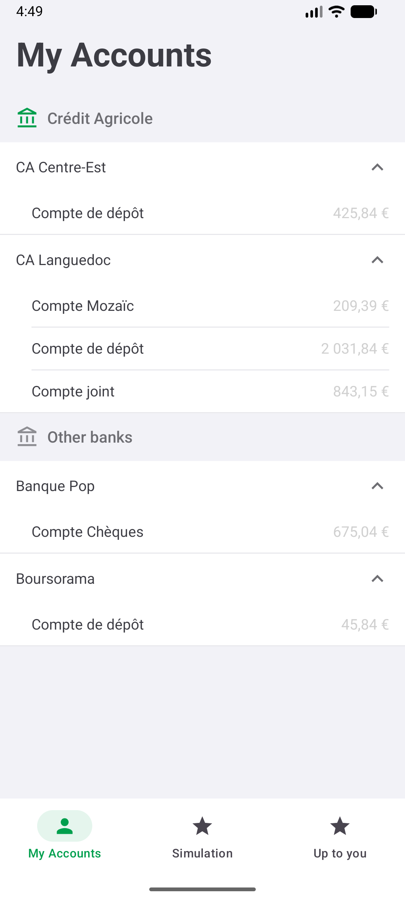
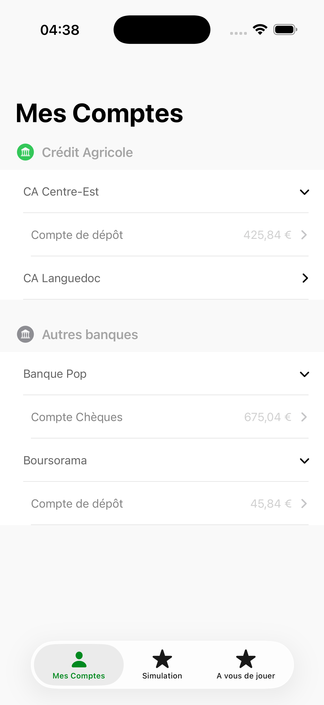
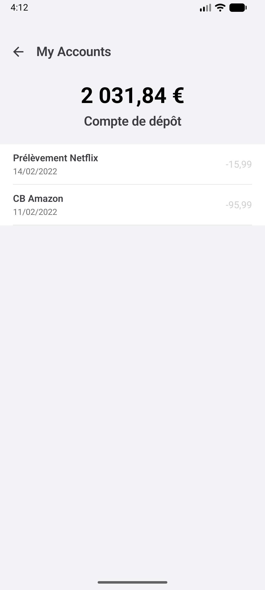
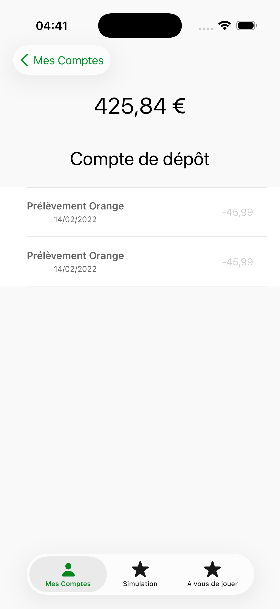
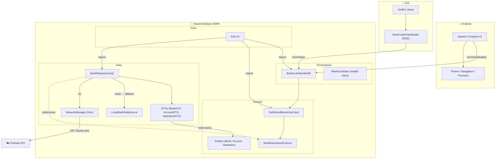
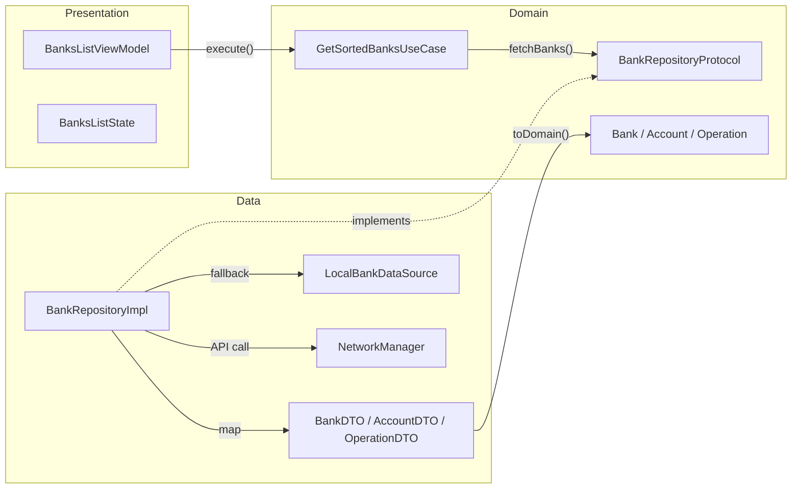

# 🏦 TestMobileCA — Kotlin Multiplatform (KMP)

> 🇫🇷 [Lire en français](README_FR.md)

A cross-platform **banking mobile app** (Android & iOS) built with **Kotlin Multiplatform** following a **Clean Architecture** approach.

> **Context**: Technical assessment — Build a mobile application that displays a list of banks, accounts, and operations from a REST API, with specific sorting (CA banks first), an **offline mode** (local JSON fallback), and a **clean, testable architecture**.

---

## 📋 Business Rules

| Rule                  | Description                                                                             |
| --------------------- | --------------------------------------------------------------------------------------- |
| **Bank sorting**      | Crédit Agricole banks (`isCA = true`) displayed first, then others, sorted by name      |
| **Account sorting**   | Alphabetical by label                                                                   |
| **Operation sorting** | By date descending, then by title alphabetically                                        |
| **Offline mode**      | If the API fails → fallback to embedded local JSON (data always visible)                |
| **UI separation**     | Native UI on each platform (Jetpack Compose / SwiftUI), shared business logic in Kotlin |

---

## 📸 Screenshots

|                      Android                      |                     iOS                      |
| :-----------------------------------------------: | :------------------------------------------: |
|   |  |
|  |  |

---

## 🏗️ High-Level Architecture



---

## 🧩 Clean Architecture — Layers



---

## 🛠 Technical Choices — Why?

### 1. **Kotlin Multiplatform (KMP)** — Required for this assessment

| KMP                      | Details                                                                                       |
| ------------------------ | --------------------------------------------------------------------------------------------- |
| **Native UI**            | Jetpack Compose (Android) and SwiftUI (iOS), no abstract UI layer → native performance and UX |
| **Shared logic only**    | ViewModel, UseCases, DTOs, networking → written once in Kotlin                                |
| **Native interop**       | Direct access to platform APIs (CoreData, Android Jetpack...) without a bridge                |
| **Progressive adoption** | No full rewrite needed — KMP can be added to an existing project                              |

### 2. **SKIE** — Swift ↔ Kotlin Interop

> Without SKIE, Kotlin `StateFlow` isn't natively consumable in Swift. I would have to write a custom Kotlin `Collector`, and `sealed class` wouldn't map to Swift `enum`.

| What SKIE does                | Impact                                                     |
| ----------------------------- | ---------------------------------------------------------- |
| `StateFlow` → `AsyncSequence` | `for await newState in viewModel.viewState` — native Swift |
| `sealed class` → Swift `enum` | `switch onEnum(of: state)` with full pattern matching      |
| Eliminates boilerplate        | No need for a Kotlin `FlowCollector` wrapper               |

### 3. **Koin** — Dependency Injection

> I chose Koin over Dagger/Hilt because it's the only DI framework that works natively with KMP across both platforms.

| Koin                                 | Dagger/Hilt                            |
| ------------------------------------ | -------------------------------------- |
| ✅ KMP compatible (multiplatform)    | ❌ Android only (annotation processor) |
| ✅ Native Kotlin DSL, no annotations | ❌ Code generation, kapt/ksp           |
| ✅ Lightweight, quick to set up      | ❌ Heavy, steep learning curve         |

```kotlin
// Koin — Declared in just 5 lines
val sharedModule = module {
    single<BankRepositoryProtocol> { BankRepositoryImpl() }
    factory { GetSortedBanksUseCase(get()) }
    factory { BanksListViewModel(get()) }
}
```

### 4. **Ktor** — HTTP Client

> Retrofit doesn't support iOS. Ktor is the natural choice for KMP — it provides a platform-specific engine for each target.

| Ktor                                                         | Retrofit                  |
| ------------------------------------------------------------ | ------------------------- |
| ✅ KMP native (iOS + Android)                                | ❌ Android only (OkHttp)  |
| ✅ Platform-specific engine (`OkHttp` Android, `Darwin` iOS) | ❌ No iOS engine          |
| ✅ Built-in `kotlinx.serialization`                          | ⚠️ Requires Gson or Moshi |

### 5. **Ktlint & SwiftLint** — Linting

I set up linting on both platforms to ensure consistent code style:

- **Ktlint** (Kotlin): configured via `.editorconfig`, auto-fixable with `./gradlew ktlintFormat`
- **SwiftLint** (Swift): configured via `.swiftlint.yml`, enforced in CI with `--strict`

### 6. **Offline mode — Embedded JSON**

> For this assessment, I kept it simple with an embedded JSON constant. In a production app, I would implement proper data persistence with Room/SQLDelight or a caching layer.

```kotlin
// BankRepositoryImpl — Transparent fallback
catch (e: Exception) {
    LocalBankDataSource.fetchBanks() // → local data
}
```

---

## 🧪 Tests & CI

### Unit tests (`shared/src/commonTest/`)

| Test                        | Coverage                                                                      |
| --------------------------- | ----------------------------------------------------------------------------- |
| `OperationCategoryTest`     | `fromString()` — valid, invalid, and null values                              |
| `OperationDTOTest`          | DTO → domain mapping                                                          |
| `BankDTOTest`               | `isCA` int→bool, nested structures                                            |
| `GetSortedBanksUseCaseTest` | CA-first sort, accounts by label, operations by date desc, error, empty lists |
| `LocalBankDataSourceTest`   | Embedded JSON parsing, 4 banks, CA/others, accounts, operations               |

### CI Pipeline (GitHub Actions)

```
push / PR → main, develop
    │
    ├── 🔍 Ktlint          (ubuntu)   — ./gradlew ktlintCheck
    ├── 🔍 SwiftLint        (macOS)    — swiftlint lint --strict
    ├── 🧪 Unit Tests       (ubuntu)   — ./gradlew :shared:testDebugUnitTest
    │
    └── 🔨 Build Android    (ubuntu)   — ./gradlew :composeApp:assembleDebug
         └── needs: ktlint ✅ + tests ✅
```

---

## ⚠️ Challenges & Solutions

### 1. SwiftLint `sorted_imports` — Inconsistent ordering

> **Problem**: SwiftLint's `sorted_imports` rule sorted differently between my local machine and the CI runner (different macOS locales). No import order worked everywhere.

**Solution**: Removed `sorted_imports` from `.swiftlint.yml`. Other rules (whitespace, naming, line length) remain active.

### 2. SKIE — Bridging `StateFlow` and `sealed class`

> **Problem**: Without SKIE, consuming a `StateFlow<BanksListState>` in Swift requires a custom Kotlin `Collector`, a manual `ObservableObject` wrapper, and the `sealed class` is seen as a class hierarchy rather than an `enum`.

**Solution**: The SKIE plugin handles this automatically:

```swift
// Without SKIE (heavy boilerplate)
viewModel.viewState.collect { state in ... } // Doesn't compile

// With SKIE — native Swift code
for await newState in viewModel.viewState { self.state = newState }
switch onEnum(of: viewModel.state) {
    case .loading: ...
    case .success(let s): ...
    case .failure(let f): ...
}
```

---

## 🚀 Build & Run

### Android

```bash
./gradlew :composeApp:assembleDebug
```

### iOS

Open `iosApp/` in Xcode → Run on simulator or device.

### Tests

```bash
./gradlew :shared:testDebugUnitTest
```

### Linting

```bash
# Kotlin
./gradlew ktlintCheck          # Check
./gradlew ktlintFormat         # Auto-fix

# Swift
swiftlint lint --config .swiftlint.yml --strict
```

---

## 💡 Possible Improvements

- **Shared Design Tokens**: Colors, font sizes, and spacing constants could be defined in `shared/commonMain` (e.g., `AppColors`, `AppFonts`) so both platforms consume the same values. Currently, each platform defines its own design system (`MaterialTheme` on Android, SwiftUI assets on iOS), which means a color change requires two edits. Shared Kotlin constants (`Long` hex values, `Int` sizes) would centralize this — each platform would just map them to their native types (`Color(0xFF...)` on Android, `Color(hex:)` on iOS).
- **Data Persistence**: Replace the embedded JSON fallback with Room/SQLDelight for proper offline caching with fresh API data.
- **ViewModel Tests**: Add unit tests for `BanksListViewModel` by mocking `GetSortedBanksUseCase`.

---

## 📦 Tech Stack

| Technology            | Version | Usage                                     |
| --------------------- | ------- | ----------------------------------------- |
| Kotlin                | 2.3.10  | Main language (shared + Android)          |
| Compose Multiplatform | 1.10.1  | Android UI                                |
| SwiftUI               | —       | iOS UI                                    |
| Ktor                  | 3.4.0   | HTTP Client (multiplatform)               |
| kotlinx.serialization | 1.10.0  | JSON parsing                              |
| Koin                  | 4.1.1   | Dependency Injection (multiplatform)      |
| SKIE                  | 0.10.10 | Swift interop (StateFlow → AsyncSequence) |
| Ktlint                | 12.1.2  | Kotlin linter                             |
| SwiftLint             | —       | Swift linter                              |
| GitHub Actions        | —       | CI/CD                                     |
| JDK                   | 17      | Build toolchain                           |
