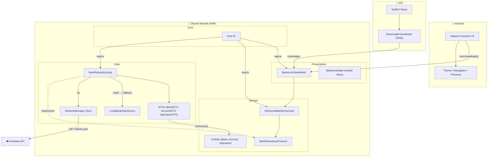
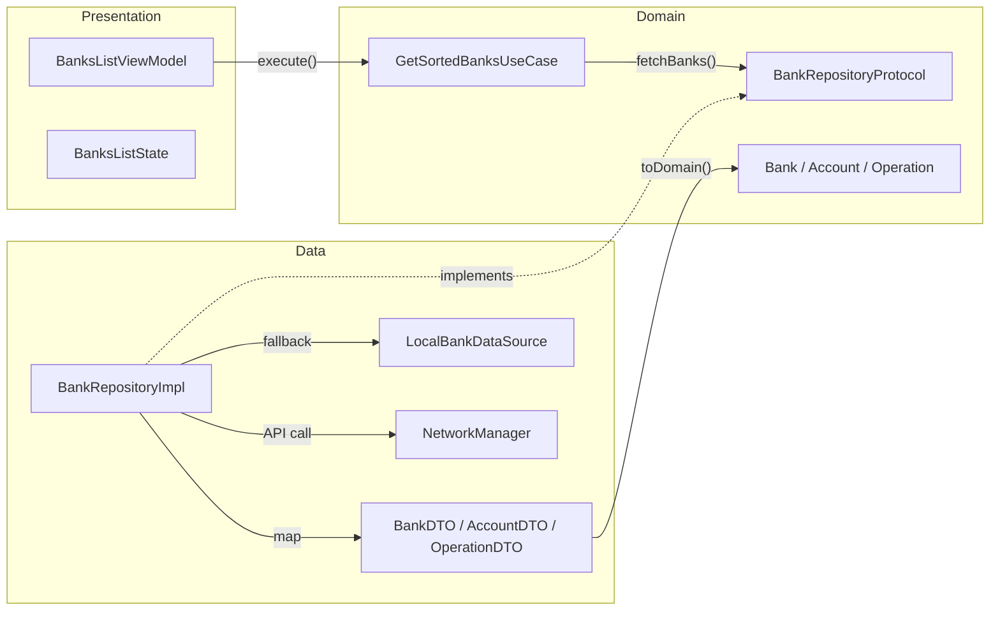

# 🏦 TestMobileCA — Kotlin Multiplatform (KMP)

Application mobile **bancaire multiplateforme** (Android & iOS) développée en **Kotlin Multiplatform** avec une architecture **Clean Architecture**.

> **Contexte** : Test technique Crédit Agricole — Développer une application mobile affichant une liste de banques, comptes et opérations depuis une API REST, avec un tri spécifique (banques CA en premier), un **mode offline** (fallback JSON local), et une architecture **propre et testable**.

---

## 📋 Règles métier

| Règle                  | Description                                                                                   |
| ---------------------- | --------------------------------------------------------------------------------------------- |
| **Tri des banques**    | Banques Crédit Agricole (`isCA = true`) affichées en premier, puis les autres, triées par nom |
| **Tri des comptes**    | Par label alphabétique                                                                        |
| **Tri des opérations** | Par date décroissante, puis par titre alphabétique                                            |
| **Mode offline**       | Si l'API échoue → fallback sur le JSON local embarqué (données toujours visibles)             |
| **Séparation UI**      | UI native sur chaque plateforme (Jetpack Compose / SwiftUI), logique partagée en Kotlin       |

---

## 🏗️ Architecture High-Level



---

## 🧩 Clean Architecture — Couches



---

## 🛠 Choix techniques — Pourquoi ?

### 1. **Kotlin Multiplatform (KMP)** — au lieu de Flutter / React Native

| Pourquoi KMP                    | Détail                                                                                              |
| ------------------------------- | --------------------------------------------------------------------------------------------------- |
| **UI native**                   | Jetpack Compose (Android) et SwiftUI (iOS), pas de couche UI abstraite → performances et UX natives |
| **Logique partagée uniquement** | ViewModel, UseCases, DTOs, networking → écrits une seule fois en Kotlin                             |
| **Interop native**              | Accès direct aux APIs plateforme (CoreData, Android Jetpack...) sans bridge                         |
| **Adoption progressive**        | Pas de réécriture totale — on peut ajouter KMP à un projet existant                                 |

### 2. **SKIE** — Swift ↔ Kotlin Interop

> Problème : Les `StateFlow` Kotlin ne sont pas natifs en Swift. Sans SKIE, il faudrait écrire un `Collector` Kotlin manuellement, et les `sealed class` ne sont pas des `enum Swift`.

| Ce que fait SKIE              | Impact                                                         |
| ----------------------------- | -------------------------------------------------------------- |
| `StateFlow` → `AsyncSequence` | `for await newState in viewModel.viewState` — code Swift natif |
| `sealed class` → Swift `enum` | `switch onEnum(of: state)` avec pattern matching complet       |
| Élimine le boilerplate        | Pas besoin de wrapper Kotlin `FlowCollector`                   |

### 3. **Koin** — Injection de dépendances

> Pourquoi Koin et pas Dagger/Hilt ?

| Koin                                   | Dagger/Hilt                            |
| -------------------------------------- | -------------------------------------- |
| ✅ KMP compatible (multiplateforme)    | ❌ Android only (annotation processor) |
| ✅ DSL Kotlin natif, pas d'annotations | ❌ Génération de code, kapt/ksp        |
| ✅ Légère, rapide à configurer         | ❌ Lourd, courbe d'apprentissage       |

```kotlin
// Koin — Déclaration en 5 lignes
val sharedModule = module {
    single<BankRepositoryProtocol> { BankRepositoryImpl() }
    factory { GetSortedBanksUseCase(get()) }
    factory { BanksListViewModel(get()) }
}
```

### 4. **Ktor** — HTTP Client

> Pourquoi Ktor et pas Retrofit ?

| Ktor                                                      | Retrofit                   |
| --------------------------------------------------------- | -------------------------- |
| ✅ KMP natif (iOS + Android)                              | ❌ Android only (OkHttp)   |
| ✅ Moteur par plateforme (`OkHttp` Android, `Darwin` iOS) | ❌ Pas de moteur iOS       |
| ✅ `kotlinx.serialization` intégré                        | ⚠️ Nécessite Gson ou Moshi |

### 5. **Ktlint** — Linter Kotlin (au lieu de Detekt)

> Pourquoi pas Detekt ?

| Ktlint                                         | Detekt                                              |
| ---------------------------------------------- | --------------------------------------------------- |
| ✅ Focus **style/formatage** (comme SwiftLint) | ❌ Analyse statique → trop de faux positifs Compose |
| ✅ Auto-fix (`ktlintFormat`)                   | ❌ Pas d'auto-fix natif                             |
| ✅ Config via `.editorconfig` (standard)       | ❌ Config YAML custom                               |
| ✅ Rapide, léger                               | ⚠️ Plus lourd, plus configurable                    |

**Detekt a été initialement configuré puis retiré** car il générait de nombreux faux positifs sur le code Compose (fonctions longues, noms de fonctions Composable en PascalCase, wildcard imports...).

### 6. **SwiftLint** — Linter Swift

Même philosophie que Ktlint côté iOS :

- Config via `.swiftlint.yml`
- Appliqué en CI avec `--strict` (warnings → errors)
- Règles adaptées au projet (vertical whitespace, line length 120, type naming...)

### 7. **Mode offline — JSON embarqué**

> Pourquoi ne pas utiliser `expect/actual` ou `Room` ?

| Approche choisie                                  | Alternatives rejetées                                                                     |
| ------------------------------------------------- | ----------------------------------------------------------------------------------------- |
| ✅ JSON embarqué en `const val` dans `commonMain` | ❌ `expect/actual` : nécessite assets Android + Bundle iOS (2 fichiers platform-specific) |
| ✅ 0 dépendance supplémentaire                    | ❌ Room/SQLite : overkill pour du cache statique                                          |
| ✅ Fonctionne immédiatement sur iOS ET Android    | ❌ Compose Resources : non disponible dans le module `shared`                             |

```kotlin
// BankRepositoryImpl — Fallback transparent
catch (e: Exception) {
    LocalBankDataSource.fetchBanks() // → données locales
}
```

---

## 📁 Structure du projet

```
TestMobileCAKMP/
├── shared/                          # 🔗 Module partagé (KMP)
│   └── src/commonMain/kotlin/
│       ├── core/
│       │   ├── di/Koin.kt          # Injection de dépendances
│       │   └── network/NetworkManager.kt
│       └── modules/account/
│           ├── data/
│           │   ├── datasources/LocalBankDataSource.kt  # Offline fallback
│           │   ├── models/          # DTOs (BankDTO, AccountDTO, OperationDTO)
│           │   └── repositories/BankRepositoryImpl.kt
│           ├── domain/
│           │   ├── entities/        # Bank, Account, Operation, OperationCategory
│           │   ├── interfaces/BankRepositoryProtocol.kt
│           │   └── usecases/GetSortedBanksUseCase.kt
│           └── presentation/
│               └── viewmodels/BanksListViewModel.kt
│
├── composeApp/                      # 📱 Android (Jetpack Compose)
│   └── src/androidMain/kotlin/
│       ├── core/
│       │   ├── navigation/          # AppNavHost, AppBottomBar, AppTab
│       │   ├── theme/               # Color, Theme, Typography
│       │   ├── preview/PreviewData.kt
│       │   └── utils/CurrencyUtils.kt
│       └── modules/account/presentation/
│           ├── banksList/           # BanksListScreen, BankRow, AccountRow, etc.
│           └── operationsList/      # OperationsListScreen, OperationRow
│
├── iosApp/                          # 🍎 iOS (SwiftUI)
│   └── iosApp/
│       ├── ContentView.swift        # TabBar + navigation
│       ├── iOSApp.swift             # Entry point + Koin init
│       ├── core/extensions/KMPExtensions.swift  # Identifiable conformance
│       └── modules/acccount/presentation/
│           ├── banksList/           # BanksListView, BankRow, AccountRow
│           └── operationsList/      # OperationsListView, OperationsRow
│
├── .github/workflows/ci.yml        # 🔄 CI Pipeline
├── .editorconfig                    # Ktlint config
├── .swiftlint.yml                   # SwiftLint config
└── build.gradle.kts                 # Root + Ktlint plugin
```

---

## 🧪 Tests & CI

### Tests unitaires (`shared/src/commonTest/`)

| Test                        | Couverture                                                                    |
| --------------------------- | ----------------------------------------------------------------------------- |
| `OperationCategoryTest`     | `fromString()` — valeurs valides, invalides, null                             |
| `OperationDTOTest`          | Mapping DTO → domaine                                                         |
| `BankDTOTest`               | `isCA` int→bool, nested structures                                            |
| `GetSortedBanksUseCaseTest` | Tri CA-first, comptes par label, opérations par date desc, erreur, liste vide |
| `LocalBankDataSourceTest`   | Parsing JSON embarqué, 4 banques, CA/autres, comptes, opérations              |

### CI Pipeline (GitHub Actions)

```
push / PR → main, develop
    │
    ├── 🔍 Ktlint          (ubuntu)   — ./gradlew ktlintCheck
    ├── 🔍 SwiftLint        (macOS)    — swiftlint lint --strict
    ├── 🧪 Unit Tests       (ubuntu)   — ./gradlew :shared:testDebugUnitTest
    │
    └── 🔨 Build Android    (ubuntu)   — ./gradlew :composeApp:assembleDebug
         └── needs: ktlint ✅ + tests ✅
```

---

## ⚠️ Difficultés rencontrées & solutions

### 1. `LazyColumn` — Clés dupliquées

> **Problème** : `java.lang.IllegalArgumentException: Key "2" was already used` — crash au runtime car les IDs d'opérations ne sont pas uniques dans l'API.

**Solution** : Utilisation d'un UUID composite comme clé dans la `LazyColumn` au lieu de la simple `id` de l'opération. Chaque item est identifié de façon unique par sa position dans la liste.

### 2. Detekt → Ktlint

> **Problème** : Detekt générait des **faux positifs massifs** sur le code Compose :
>
> - `FunctionNaming` : les Composables sont en PascalCase (`@Composable fun BankRow()`)
> - `LongMethod` : les fonctions Compose modernes dépassent facilement les seuils
> - `WildcardImport` : Compose utilise `import androidx.compose.material3.*`
> - `MagicNumber` : Les paddings/sizes sont des constantes visuelles, pas des magic numbers

**Solution** : Remplacement par **Ktlint** — focus formatage uniquement, pas d'analyse sémantique. Configuration via `.editorconfig` avec les règles désactivées qui conflictuent :

```ini
# Compose utilise des wildcard imports
ktlint_standard_no-wildcard-imports = disabled
# Compose : fonctions PascalCase dans les tests et previews
ktlint_standard_function-naming = disabled
# Package avec underscore (testmobileca_kmp)
ktlint_standard_package-name = disabled
```

### 3. SwiftLint `sorted_imports` — Ordre inconsistant

> **Problème** : SwiftLint exigeait un tri des imports (`sorted_imports`) mais le tri variait entre l'environnement local et CI (macOS runner vs locale différente). Impossible de trouver un ordre accepté partout.

**Solution** : Retrait de la règle `sorted_imports` de `.swiftlint.yml`. Les autres règles (whitespace, naming, line length) restent actives.

### 4. SKIE — Bridging `StateFlow` et `sealed class`

> **Problème** : Sans SKIE, consommer un `StateFlow<BanksListState>` côté Swift nécessite :
>
> 1. Un `Collector` Kotlin custom
> 2. Un `ObservableObject` wrapper avec dispatch manuels
> 3. La `sealed class` est vue comme une hiérarchie de classes, pas un `enum`

**Solution** : Le plugin SKIE transforme automatiquement :

```swift
// Avant SKIE (boilerplate lourd)
viewModel.viewState.collect { state in ... } // Ne compile pas

// Avec SKIE — code natif Swift
for await newState in viewModel.viewState { self.state = newState }
switch onEnum(of: viewModel.state) {
    case .loading: ...
    case .success(let s): ...
    case .failure(let f): ...
}
```

### 5. `compose-material-icons-extended` — Erreur de résolution

> **Problème** : `Could not find org.jetbrains.compose.material:material-icons-extended:1.10.1` — la dépendance Compose Multiplatform n'inclut pas `material-icons-extended`.

**Solution** : Utilisation de la dépendance AndroidX directe (`androidx.compose.material:material-icons-extended`) au lieu de la version Compose Multiplatform.

### 6. Configuration Cache Gradle — `MapSourceSetPathsTask`

> **Problème** : `Configuration cache state could not be cached: field __librarySourceSets__` — incompatibilité entre le cache de configuration Gradle et certaines tâches Android.

**Solution** : Le problème est résolu automatiquement lors du clean build. Pas d'impact fonctionnel.

---

## 🚀 Build & Run

### Android

```bash
./gradlew :composeApp:assembleDebug
```

### iOS

Ouvrir `iosApp/` dans Xcode → Run sur simulateur ou device.

### Tests

```bash
./gradlew :shared:testDebugUnitTest
```

### Linting

```bash
# Kotlin
./gradlew ktlintCheck          # Vérifier
./gradlew ktlintFormat         # Auto-corriger

# Swift
swiftlint lint --config .swiftlint.yml --strict
```

---

## 📦 Stack technique

| Technologie           | Version | Usage                                     |
| --------------------- | ------- | ----------------------------------------- |
| Kotlin                | 2.3.10  | Langage principal (shared + Android)      |
| Compose Multiplatform | 1.10.1  | UI Android                                |
| SwiftUI               | —       | UI iOS                                    |
| Ktor                  | 3.4.0   | HTTP Client (multiplateforme)             |
| kotlinx.serialization | 1.10.0  | JSON parsing                              |
| Koin                  | 4.1.1   | Dependency Injection (multiplateforme)    |
| SKIE                  | 0.10.10 | Swift interop (StateFlow → AsyncSequence) |
| Ktlint                | 12.1.2  | Kotlin linter                             |
| SwiftLint             | —       | Swift linter                              |
| GitHub Actions        | —       | CI/CD                                     |
| JDK                   | 17      | Build toolchain                           |
