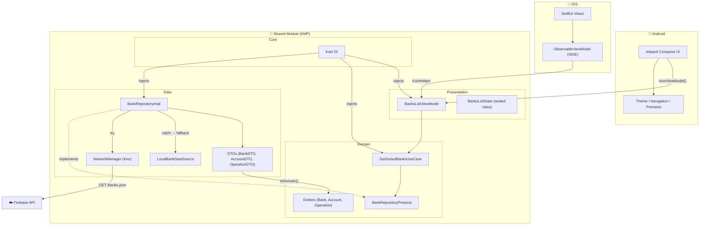

# 🏦 TestMobileCA — Kotlin Multiplatform (KMP)

> 🇬🇧 [Read in English](README.md)

Application mobile **bancaire multiplateforme** (Android & iOS) développée en **Kotlin Multiplatform** avec une **Clean Architecture**.

> **Contexte** : Test technique — Développer une application mobile affichant une liste de banques, comptes et opérations depuis une API REST, avec un tri spécifique (banques CA en premier), un **mode offline** (fallback JSON local), et une architecture **propre et testable**.

---

## 📋 Règles métier

| Règle                  | Description                                                                                   |
| ---------------------- | --------------------------------------------------------------------------------------------- |
| **Tri des banques**    | Banques Crédit Agricole (`isCA = true`) affichées en premier, puis les autres, triées par nom |
| **Tri des comptes**    | Par label alphabétique                                                                        |
| **Tri des opérations** | Par date décroissante, puis par titre alphabétique                                            |
| **Mode offline**       | Si l'API échoue → fallback sur le JSON local embarqué (données toujours visibles)             |
| **Séparation UI**      | UI native sur chaque plateforme (Jetpack Compose / SwiftUI), logique partagée en Kotlin       |

---

## 📸 Captures d'écran

|                      Android                      |                     iOS                      |
| :-----------------------------------------------: | :------------------------------------------: |
|    |   |
|  |  |

---

## 🏗️ Architecture High-Level



---

## 🧩 Clean Architecture — Couches

```mermaid
graph LR
    subgraph "Presentation"
        direction TB
        P1["BanksListViewModel"]
        P2["BanksListState"]
    end
    subgraph "Domain"
        direction TB
        D1["GetSortedBanksUseCase"]
        D2["BankRepositoryProtocol"]
        D3["Bank / Account / Operation"]
    end
    subgraph "Data"
        direction TB
        DA1["BankRepositoryImpl"]
        DA2["BankDTO / AccountDTO / OperationDTO"]
        DA3["LocalBankDataSource"]
        DA4["NetworkManager"]
    end

    P1 -->|"execute()"| D1
    D1 -->|"fetchBanks()"| D2
    DA1 -.->|implements| D2
    DA1 -->|"API call"| DA4
    DA1 -->|"fallback"| DA3
    DA1 -->|"map"| DA2
    DA2 -->|"toDomain()"| D3
```



---

## 🛠 Choix techniques — Pourquoi ?

### 1. **Kotlin Multiplatform (KMP)** — Requis pour ce test

| KMP                             | Détail                                                                                              |
| ------------------------------- | --------------------------------------------------------------------------------------------------- |
| **UI native**                   | Jetpack Compose (Android) et SwiftUI (iOS), pas de couche UI abstraite → performances et UX natives |
| **Logique partagée uniquement** | ViewModel, UseCases, DTOs, networking → écrits une seule fois en Kotlin                             |
| **Interop native**              | Accès direct aux APIs plateforme (CoreData, Android Jetpack...) sans bridge                         |
| **Adoption progressive**        | Pas de réécriture totale — on peut ajouter KMP à un projet existant                                 |

### 2. **SKIE** — Swift ↔ Kotlin Interop

> Sans SKIE, les `StateFlow` Kotlin ne sont pas consommables nativement en Swift. J'aurais dû écrire un `Collector` Kotlin custom, et les `sealed class` ne seraient pas converties en `enum` Swift.

| Ce que fait SKIE              | Impact                                                         |
| ----------------------------- | -------------------------------------------------------------- |
| `StateFlow` → `AsyncSequence` | `for await newState in viewModel.viewState` — code Swift natif |
| `sealed class` → Swift `enum` | `switch onEnum(of: state)` avec pattern matching complet       |
| Élimine le boilerplate        | Pas besoin de wrapper Kotlin `FlowCollector`                   |

### 3. **Koin** — Injection de dépendances

> J'ai choisi Koin plutôt que Dagger/Hilt car c'est le seul framework DI qui fonctionne nativement avec KMP sur les deux plateformes.

| Koin                                   | Dagger/Hilt                            |
| -------------------------------------- | -------------------------------------- |
| ✅ KMP compatible (multiplateforme)    | ❌ Android only (annotation processor) |
| ✅ DSL Kotlin natif, pas d'annotations | ❌ Génération de code, kapt/ksp        |
| ✅ Légère, rapide à configurer         | ❌ Lourd, courbe d'apprentissage       |

```kotlin
// Koin — Déclaration en 5 lignes
val sharedModule = module {
    single<BankRepositoryProtocol> { BankRepositoryImpl() }
    factory { GetSortedBanksUseCase(get()) }
    factory { BanksListViewModel(get()) }
}
```

### 4. **Ktor** — HTTP Client

> Retrofit ne supporte pas iOS. Ktor est le choix naturel pour KMP — il fournit un moteur spécifique pour chaque plateforme.

| Ktor                                                      | Retrofit                   |
| --------------------------------------------------------- | -------------------------- |
| ✅ KMP natif (iOS + Android)                              | ❌ Android only (OkHttp)   |
| ✅ Moteur par plateforme (`OkHttp` Android, `Darwin` iOS) | ❌ Pas de moteur iOS       |
| ✅ `kotlinx.serialization` intégré                        | ⚠️ Nécessite Gson ou Moshi |

### 5. **Ktlint & SwiftLint** — Linting

J'ai mis en place du linting sur les deux plateformes pour garantir un style de code cohérent :

- **Ktlint** (Kotlin) : configuré via `.editorconfig`, auto-corrigible avec `./gradlew ktlintFormat`
- **SwiftLint** (Swift) : configuré via `.swiftlint.yml`, appliqué en CI avec `--strict`

### 6. **Mode offline — JSON embarqué**

> Pour ce test, j'ai opté pour un JSON embarqué en constante Kotlin — simple et efficace. Dans un contexte de production, j'implémenterais de la vraie persistance de données avec Room/SQLDelight ou une couche de cache.

```kotlin
// BankRepositoryImpl — Fallback transparent
catch (e: Exception) {
    LocalBankDataSource.fetchBanks() // → données locales
}
```

---

## 🧪 Tests & CI

### Tests unitaires (`shared/src/commonTest/`)

| Test                        | Couverture                                                                    |
| --------------------------- | ----------------------------------------------------------------------------- |
| `OperationCategoryTest`     | `fromString()` — valeurs valides, invalides, null                             |
| `OperationDTOTest`          | Mapping DTO → domaine                                                         |
| `BankDTOTest`               | `isCA` int→bool, structures imbriquées                                        |
| `GetSortedBanksUseCaseTest` | Tri CA-first, comptes par label, opérations par date desc, erreur, liste vide |
| `LocalBankDataSourceTest`   | Parsing JSON embarqué, 4 banques, CA/autres, comptes, opérations              |

### CI Pipeline (GitHub Actions)

```
push / PR → main, develop
    │
    ├── 🔍 Ktlint          (ubuntu)   — ./gradlew ktlintCheck
    ├── 🔍 SwiftLint        (macOS)    — swiftlint lint --strict
    ├── 🧪 Unit Tests       (ubuntu)   — ./gradlew :shared:testDebugUnitTest
    │
    └── 🔨 Build Android    (ubuntu)   — ./gradlew :composeApp:assembleDebug
         └── needs: ktlint ✅ + tests ✅
```

---

## ⚠️ Difficultés rencontrées & solutions

### 1. SwiftLint `sorted_imports` — Ordre inconsistant

> **Problème** : La règle `sorted_imports` de SwiftLint triait les imports différemment entre ma machine locale et le runner CI (locales macOS différentes). Aucun ordre ne fonctionnait partout.

**Solution** : Retrait de `sorted_imports` de `.swiftlint.yml`. Les autres règles (whitespace, naming, line length) restent actives.

### 2. SKIE — Bridging `StateFlow` et `sealed class`

> **Problème** : Sans SKIE, consommer un `StateFlow<BanksListState>` côté Swift nécessite un `Collector` Kotlin custom, un wrapper `ObservableObject` manuel, et la `sealed class` est vue comme une hiérarchie de classes plutôt qu'un `enum`.

**Solution** : Le plugin SKIE transforme tout ça automatiquement :

```swift
// Sans SKIE (boilerplate lourd)
viewModel.viewState.collect { state in ... } // Ne compile pas

// Avec SKIE — code natif Swift
for await newState in viewModel.viewState { self.state = newState }
switch onEnum(of: viewModel.state) {
    case .loading: ...
    case .success(let s): ...
    case .failure(let f): ...
}
```

---

## 🚀 Build & Run

### Android

```bash
./gradlew :composeApp:assembleDebug
```

### iOS

Ouvrir `iosApp/` dans Xcode → Run sur simulateur ou device.

### Tests

```bash
./gradlew :shared:testDebugUnitTest
```

### Linting

```bash
# Kotlin
./gradlew ktlintCheck          # Vérifier
./gradlew ktlintFormat         # Auto-corriger

# Swift
swiftlint lint --config .swiftlint.yml --strict
```

---

## � Améliorations possibles

- **Design Tokens partagés** : Les couleurs, tailles de police et espacements pourraient être définis dans `shared/commonMain` (ex : `AppColors`, `AppFonts`) pour que les deux plateformes consomment les mêmes valeurs. Actuellement, chaque plateforme définit son propre design system (`MaterialTheme` sur Android, assets SwiftUI sur iOS), ce qui signifie qu'un changement de couleur nécessite deux modifications. Des constantes Kotlin partagées (`Long` hex, `Int` tailles) centraliseraient cela — chaque plateforme les mapperait simplement vers ses types natifs (`Color(0xFF...)` sur Android, `Color(hex:)` sur iOS).
- **Persistance de données** : Remplacer le JSON embarqué par Room/SQLDelight pour un vrai cache offline avec des données fraîches de l'API.
- **Tests ViewModel** : Ajouter des tests unitaires pour `BanksListViewModel` en mockant `GetSortedBanksUseCase`.

---

## �📦 Stack technique

| Technologie           | Version | Usage                                      |
| --------------------- | ------- | ------------------------------------------ |
| Kotlin                | 2.3.10  | Langage principal (shared + Android)       |
| Compose Multiplatform | 1.10.1  | UI Android                                 |
| SwiftUI               | —       | UI iOS                                     |
| Ktor                  | 3.4.0   | HTTP Client (multiplateforme)              |
| kotlinx.serialization | 1.10.0  | JSON parsing                               |
| Koin                  | 4.1.1   | Injection de dépendances (multiplateforme) |
| SKIE                  | 0.10.10 | Interop Swift (StateFlow → AsyncSequence)  |
| Ktlint                | 12.1.2  | Linter Kotlin                              |
| SwiftLint             | —       | Linter Swift                               |
| GitHub Actions        | —       | CI/CD                                      |
| JDK                   | 17      | Build toolchain                            |
